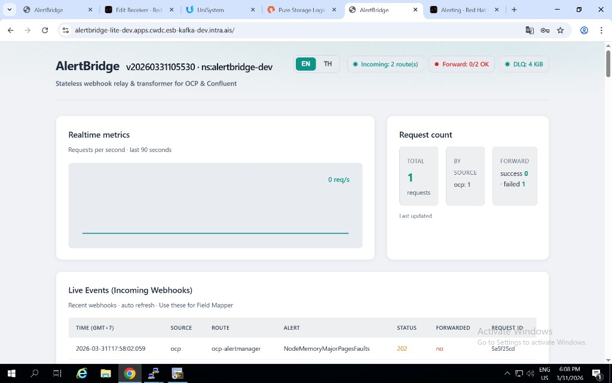
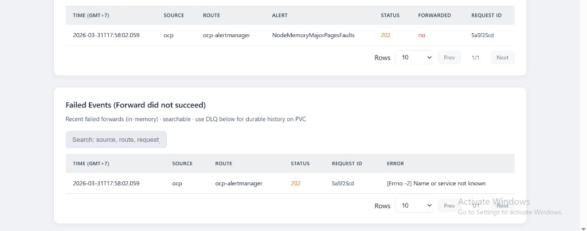
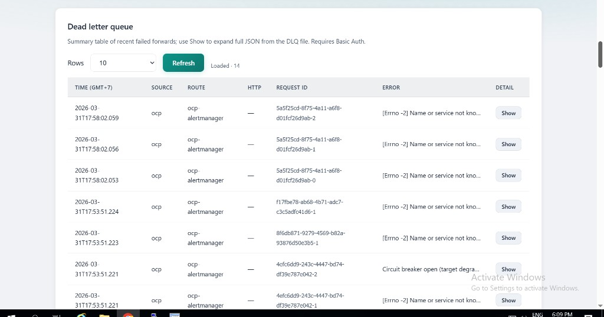
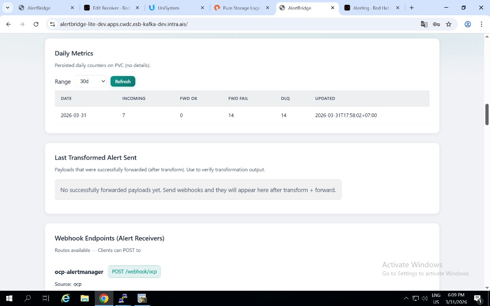
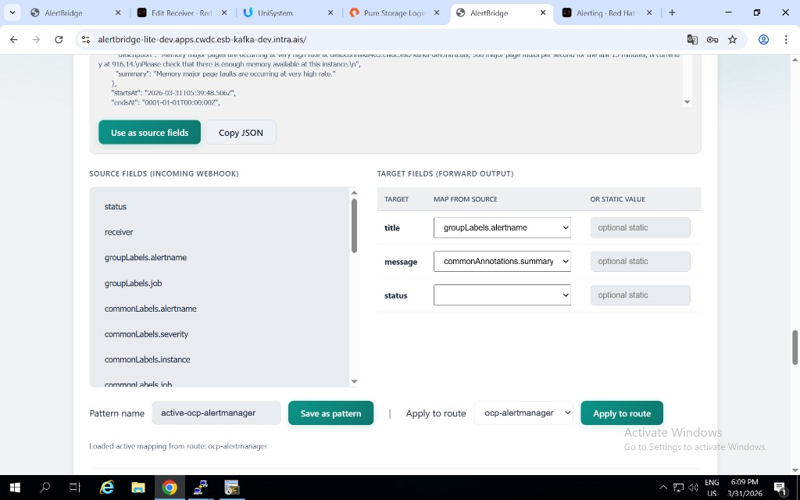
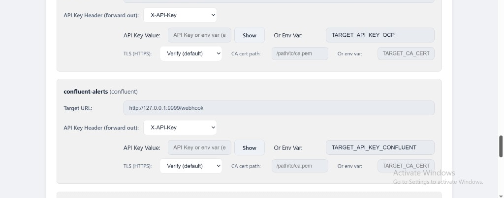

# AlertBridge

Alert relay and transformer for OpenShift/Kubernetes. AlertBridge receives webhook payloads, transforms them with route rules, forwards to target systems, and keeps durable failed records (DLQ) on PVC for trace and recovery.

**Author:** Sontas Jiamsripong  
**Docs:** [ARCHITECTURE.md](ARCHITECTURE.md) · [FEATURES.md](FEATURES.md) · [deploy/OCP_DEPLOY.md](deploy/OCP_DEPLOY.md)

---

## What You Get

- Fast API service (`FastAPI` + `httpx`) for webhook receive/transform/forward
- Route-based transform (map/include/drop/rename/enrich/template)
- Modern light UI (EN/TH) with live events, failed events, DLQ, daily metrics
- Durable DLQ on PVC (`20Gi` default in OpenShift pull manifest)
- Daily counters on PVC (`incoming`, `fwd ok`, `fwd fail`, `dlq`)
- Request traceability with base request id and retry metadata
- In-cluster webhook URL helper for internal clients
- Prometheus endpoint and operational status badges

---

## UI Snapshot

### 1) Overview: status badges, realtime metrics, request count



### 2) Live and Failed events with paging



### 3) DLQ table (durable failed forward history on PVC)



### 4) Daily metrics (persisted counters)



### 5) Field Mapper (source-to-target transform mapping)



### 6) Target URLs and API key config



---

## Quick Start (Local)

```powershell
python -m venv .venv
.venv\Scripts\activate
pip install -r requirements.txt

$env:ALERTBRIDGE_RULES_PATH = ".\rules.example.yaml"
python -m uvicorn app.main:app --host 0.0.0.0 --port 8080
```

Open UI: `http://localhost:8080`

---

## Run with HTTPS (Local)

```powershell
openssl req -x509 -newkey rsa:2048 -keyout key.pem -out cert.pem -days 365 -nodes -subj /CN=localhost
$env:ALERTBRIDGE_RULES_PATH = ".\rules.example.yaml"
python -m uvicorn app.main:app --host 127.0.0.1 --port 8443 --ssl-keyfile key.pem --ssl-certfile cert.pem
```

Or use `scripts/run_https.ps1`.

---

## Deploy to OpenShift

### Option A: Pull image from GHCR (recommended)

```bash
oc apply -f deploy/install-ocp-pull.yaml
```

This single manifest includes:
- Namespace, app, service, route
- Metrics and ServiceMonitor
- DLQ PVC `20Gi` with default StorageClass
- In-cluster namespace/service env setup for internal webhook URL display

Image: `ghcr.io/goasutlor/alertbridge-lite:latest`

### Option B: Dev/Separate site

Use `deploy/install-ocp-pull-dev.yaml` for `alertbridge-dev` style deployment.

### Option C: Build from source in OpenShift

```bash
oc apply -f deploy/install-ocp.yaml
oc start-build alertbridge-lite -n alertbridge
```

More details: [deploy/OCP_DEPLOY.md](deploy/OCP_DEPLOY.md)

---

## Version Upgrade Notes

- `oc apply -f ...` updates resources from manifest (including ConfigMap defaults in file)
- If only image update is needed, prefer image update + rollout
- With RWO PVC, if rollout has mount conflict, use scale down/up (`0 -> 1`) or `Recreate` strategy

---

## Example Webhook

```bash
curl -X POST http://localhost:8080/webhook/ocp \
  -H "Content-Type: application/json" \
  -d '{"status":"firing","labels":{"severity":"critical","alertname":"DiskFull"},"annotations":{"summary":"Disk 95%"}}'
```

---

## Key API Endpoints

| Endpoint | Description |
|----------|-------------|
| `POST /webhook/{source}` | Receive, transform, forward |
| `GET /` | Web UI |
| `GET /api/dlq/recent` | Recent durable DLQ rows |
| `GET /api/metrics/daily` | Daily persisted counters |
| `GET /api/in-cluster-webhook-base` | Internal webhook base URL |
| `GET /version` | Build version + namespace |
| `GET /healthz`, `GET /readyz` | Health checks |
| `GET /metrics` | Prometheus metrics |

---

## Configuration Reference

AlertBridge is configured via a YAML rules file and environment variables. Some operational parameters are hardcoded.

### Environment Variables

| Variable | Default | Description |
|----------|---------|-------------|
| `ALERTBRIDGE_RULES_PATH` | `/etc/alertbridge/rules.yaml` | Path to the rules YAML config file |
| `ALERTBRIDGE_CONFIGMAP_NAME` | *(empty)* | Kubernetes ConfigMap name for rules persistence (OCP) |
| `ALERTBRIDGE_CONFIG_WATCH_INTERVAL` | `30` | Seconds between config file change checks (0 = disable) |
| `ALERTBRIDGE_DLQ_FILE` | *(empty)* | Absolute path for DLQ JSONL file on PVC |
| `ALERTBRIDGE_DAILY_METRICS_FILE` | *(auto from DLQ dir)* | Path for daily metrics JSON |
| `ALERTBRIDGE_K8S_NAMESPACE` | *(empty)* | Kubernetes namespace (for version display & internal URL) |
| `ALERTBRIDGE_K8S_SERVICE_NAME` | `alertbridge-lite` | Kubernetes service name for internal webhook URL |
| `ALERTBRIDGE_INTERNAL_WEBHOOK_BASE` | *(auto)* | Override internal webhook base URL |
| `ALERTBRIDGE_SITE` | *(auto from Route host)* | Site label shown in UI header |
| `ALERTBRIDGE_NAMESPACE` | `alertbridge` | Namespace for ConfigMap operations |
| `ALERTBRIDGE_TARGET_STATUS_CACHE_SEC` | `30` | Target health-check cache TTL (seconds) |
| `APP_VERSION` | `1.0.08022026` | Application version string |
| `GIT_SHA` | `unknown` | Git commit SHA for `/version` |
| `LOG_LEVEL` | `INFO` | Logging level (`DEBUG`, `INFO`, `WARNING`, `ERROR`) |
| `BASIC_AUTH_USER` | *(empty)* | Fallback Basic Auth username (when not in YAML) |
| `BASIC_AUTH_PASSWORD` | *(empty)* | Fallback Basic Auth password (when not in YAML) |

### YAML Config (`rules.yaml`)

```yaml
version: 1

defaults:
  target_timeout_connect_sec: 2    # HTTP connect timeout (seconds)
  target_timeout_read_sec: 5       # HTTP read timeout (seconds)

auth:
  basic:
    users:
      - username: admin
        password_env: ADMIN_PASSWORD   # env var holding the password
  api_keys:
    required: true
    keys:
      - name: my-key
        key: "secret-value"

routes:
  - name: ocp-alertmanager
    match:
      source: ocp                   # matches POST /webhook/ocp
    target:
      url_env: FMGATEWAY_URL       # env var for target URL
      url: ""                       # or direct URL (overrides url_env)
      auth_header_env: ""           # env var for Authorization header
      api_key_header: ""            # outbound API key header name
      api_key_env: ""               # env var for API key value
      verify_tls: true              # set false for self-signed certs
      ca_cert_env: ""               # env var with CA cert path
    forward_enabled: true           # false = accept but don't forward
    unroll_alerts: false            # true = split alerts[] array, forward each separately
    verify_hmac:                    # optional webhook signature verification
      secret_env: HMAC_SECRET
      header: X-Signature-256
      algorithm: sha256
    transform:
      include_fields: []            # whitelist source paths
      drop_fields: []               # remove these paths
      rename: {}                    # { "source.path": "target.path" }
      coalesce_sources: {}          # { "target": ["path1", "path2"] } first non-empty wins
      enrich_static: {}             # { "field": "fixed value" }
      concat_templates: {}          # { "target": { template: "[{0}] {1}", paths: ["a","b"] } }
      map_values: {}                # { "field": { "old": "new" } }
      output_template:
        type: flat
        fields: {}                  # { "target_field": "$.source.path" }
```

### Concat templates (`concat_templates`)

Templates use Python `str.format` placeholders **`{0}`, `{1}`, `{2}`, …** (zero-based). In the Field Mapper UI, source columns are labeled **1, 2, 3…** but they map to **`{0}`, `{1}`, `{2}`** — not `{1}` / `{2}`.

- **`{0}`** = value from the **first** path in `paths`
- **`{1}`** = value from the **second** path
- If a path is missing or the value is `null`, that segment becomes an **empty string** (you may see `"[firing] "` with nothing after the space).

**Alertmanager / OpenShift:** The firing status at the webhook root is usually `status` (e.g. `firing`). The alert name may appear as:

- `alerts.0.labels.alertname` — typical; **with `unroll_alerts: true`**, each shard still has `alerts[0]` for that alert.
- `groupLabels.alertname` — often present at the **webhook root**; use this if per-alert `labels` does not include `alertname` in your payload.

Any path you reference in `concat_templates.paths` must be covered by **`include_fields`** (or the whole subtree via a parent path like `alerts` or `groupLabels`). If you add `groupLabels.alertname` as a path, include **`groupLabels`** (and parents) in `include_fields`.

Example that avoids a missing second value when per-alert labels omit the name:

```yaml
include_fields:
  - status
  - groupLabels
  - groupLabels.alertname
  - alerts
  # ... other paths as needed
concat_templates:
  alarmName:
    template: '[{0}] {1}'
    paths:
      - status
      - groupLabels.alertname
```

### Hardcoded Operational Parameters

These are compile-time constants. Change requires code edit and redeploy.

| Parameter | Value | File | Description |
|-----------|-------|------|-------------|
| Forward retry attempts | **4** (0s, 1s, 2s, 4s backoff) | `app/forwarder.py` | Exponential backoff on 5xx / connection error |
| Circuit breaker threshold | **5** consecutive failures | `app/forwarder.py` | Opens circuit after N failures |
| Circuit breaker reset | **60** seconds | `app/forwarder.py` | Time before half-open retry |
| Live webhooks buffer | **20** events | `app/main.py` | In-memory, lost on restart |
| Recent payloads buffer | **30** payloads | `app/main.py` | For "Use as source pattern" in Field Mapper |
| Failed events buffer | **200** events | `app/main.py` | In-memory failed forwards |
| Sent buffer (internal) | **50** entries | `app/main.py` | In-memory transformed forwards |
| Sent API display limit | **5** entries | `app/main.py` | "Recent transformed forwards" shown in UI |
| Max config body size | **512 KiB** | `app/main.py` | Maximum rules YAML upload size |

---

## Security

- VA test guide: [VA_TEST.md](VA_TEST.md)
- Dependency scan: [SECURITY.md](SECURITY.md)
